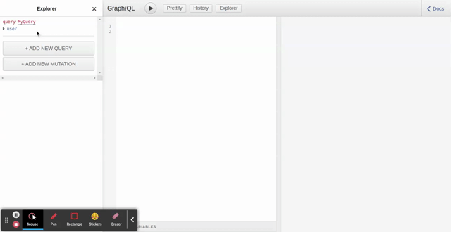

# Mock API with custom data for your Multi-Tenant Serverless API CDK TypeScript Project!

## Getting Started

Create a `user.graphql` schema file in your app directory and generate an AWS CDK project using the panacloud cli.

    mkdir my_user_api

    cd my_user_api

    panacloud init

Answer the following question on the command prompt:

* GraphQL Schema File Path? ../user.graphql

* API Name? MyUserAPI

* Select Database? Neptune (Graph) 

* Select Query Language? Gremlin

Now the MyUserAPI code is generated and available in the `my_user_api` directory.

The `mock_lambda` directory, which is produced automatically by the Panacloud CLI, will be visible. If you perform the `panacloud update` command, this mock_lambda will update automatically.

Initially `mock_lambda_layer` directory is set as lambda layer it contains all the data that mock lambda returns and it is automatically updated whenever `panacloud update` command runs.If you want to add custom data for mock api, Panacloud CLI allows you to do so under the `editable src/customMockLambdaLayer/mockData/*` directory, which will not be automatically updated after executing the `panacloud update` command.

Follow the steps below to use custom mock lambda in your CLI app.

* Change the `mockData` is_custom property in editable src/panacloudconfig.json from `false` to `true` or run `panacloud config:customData -t` command(doing through command is recommended)
* Run the `panacloud update` command (This will update all mock lambda imports in CLI generated code)

#### Caution!
If you make a change to the graphql schema in `editable/src/graphql/schema/schema.graphql` and then execute the command `panacloud update`, your custom customMockLambdaLayer will not be updated. Instead, it will only change `types` inside `types/index.ts`, and the user will need to update his code accordingly.

#### Output

## Understand the Project Generated by the CLI

This is a project for Multi-Tenant Serverless API development with [AWS Cloud Development Kit (CDK)](https://docs.aws.amazon.com/cdk/latest/guide/home.html) using TypeScript. It comes with all the necessary code to develop and deploy a Serverless GraphQL API in the AWS Cloud.  This includes the provisioning of cloud infrastructure in code and Serverless stubs where developers may easily include their business logic. The project also provides pre-built mock lambda functions and unit tests to test your deployed APIs. 

The project code may be conceptually divided into two parts:

1. The code that is generated by the Panacloud CLI, and will continuously be updated by the CLI as your API schema evolves. If the developer edits and updated this code, it will be overwritten next time the schema is updated and Panacloud CLI update command is given.
2. The code that the developer edits and updates and contains the business logic for the APIs. This code is contained in the `editable_src/` directory. 

It is highly recommended that the developer only edit and update the code contained in the `editable_src/` directory because the rest of the code is generated and updated by the Panacloud CLI.

The generated project code includes the mock lambdas contained in the `mock_lambda` directory in the root project folder. Typically, the developer will write business logic in the stub lambdas contained in the `editable_src/lambdas/` directory. The configuration contained in the `editable_src/panacloudconfig.json` file decides which lambda the APIs will call. Therefore, the project may be using mock lambdas in some calls and the real stub lambdas in other calls. This flexibility allows the developer to seamlessly transition from mock APIs towards real APIs, without the API users and testers even noticing it. Also, the mock APIs may be deployed right away.

The API CDK stack (cloud infrastructure in code) is generated by the Panacloud CLI `panacloud init` command given the API schema. API development is an iterative process, therefore when the developer updates the API schema in the `editable_src/graphql/schema/` directory and runs the `panacloud update` command the project's CDK code is updated. Given this cycle, most of the CDK stack is generated and updated by the Panacloud CLI. However, the developer has the flexibility to add and update the CDK stack by adding and updating visitors in the `editable_src/aspects/` directory. The Panacloud framework uses [Aspects](https://docs.aws.amazon.com/cdk/latest/guide/aspects.html) to enhance generated constructs and add cloud constructs written by the API developers.

The `editable_src/` directory contains all the code which the developer edits.  

The `editable_src/lambdas/` directory contains all the lambda stubs where the developer writes the business logic.  

The `editable_src/panacloudconfig.json` file tells the Panacloud framework which lambda functions to call.

The `editable_src/aspects` directory contains all the CDK code which the developer adds to the project CDK stack.  

The `cdk.json` file tells the CDK Toolkit how to execute your app.

## Useful commands

 * `panacloud update` updates the generated code and is run after updating the schema in the `editable_src/graphql/schema/` directory 
 * `npm run build`   compile typescript to js
 * `npm run watch`   watch for changes and compile
 * `npm run test`    perform the jest unit tests
 * `cdk deploy`      deploy this stack to your default AWS account/region
 * `cdk diff`        compare deployed stack with current state
 * `cdk synth`       emits the synthesized CloudFormation template

 ## The Panacloud Dapp and Protocol Complements Your APIs

 The [Panacloud Dapp](https://www.panacloud.org/) and [protocol](https://github.com/panacloud/protocol) complements the [Panacloud CLI](https://github.com/panacloud/cli) and facilitates you, the API developer to: 
 
 1. [Tokenize](https://cryptonews.com/news/tokenization-crowdfunding-in-the-era-of-cryptocurrency-and-b-10972.htm) your APIs and raise funding for API development.
 2. Document your ownership of the API by issuing you an [NFT](https://ethereum.org/en/nft/).
 3. Market your APIs to the application developers in the API bazaar/store.
 4. Create a decentralized [autonomous organization (DAO)](https://ethereum.org/en/dao/) for your APIs for governance in which the API token holders i.e. you, investors, and users can participate.
 5. Monitor your APIs and do multi-tenant billing and clearing on the Ethereum blockchain using smart contracts. 
 6. Issue tokens to your API early adopters and users to incentivize them to subscribe and use your APIs and become a participant in the [Owership Economy](https://variant.fund/writing/the-ownership-economy-crypto-and-consumer-software).
 8. Cash out whenever you require liquidity by selling your API tokens.
